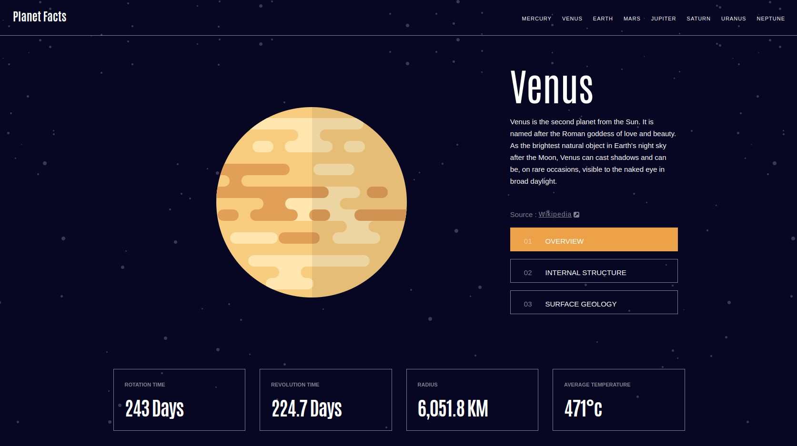

# Frontend Mentor - Planets fact site solution

This is a solution to the [Planets fact site challenge on Frontend Mentor](https://www.frontendmentor.io/challenges/planets-fact-site-gazqN8w_f). Frontend Mentor challenges help you improve your coding skills by building realistic projects.

## Table of contents

- [Overview](#overview)
  - [The challenge](#the-challenge)
  - [Screenshot](#screenshot)
  - [Links](#links)
- [My process](#my-process)
  - [Built with](#built-with)
  - [What I learned](#what-i-learned)
  - [Continued development](#continued-development)
- [Author](#author)

**Note: Delete this note and update the table of contents based on what sections you keep.**

## Overview

### The challenge

Users should be able to:

- View the optimal layout for the app depending on their device's screen size
- See hover states for all interactive elements on the page
- View each planet page and toggle between "Overview", "Internal Structure", and "Surface Geology"

### Screenshot

### Links

- Solution URL: [Add solution URL here](https://github.com/TheShonuff/space-facts)
- Live Site URL: [Add live site URL here](https://creative-gelato-398182.netlify.app)

## My process

### Built with

- CSS custom properties
- Flexbox
- [Svelte Kit](https://kit.svelte.dev/)

### What I learned

This was a great excerise to learn Svelte. I've been experimenting with some different frameworks latelt and Svelte was really enjoyable to learn. I didn't really have any issues when creating the solution to this challenge. The main hurdle was getting the planets to display different sizes based on the viewing device. I had to use reactivity and set the style tag appropriately. Working with Stores was a breath of fresh air compared to how React handles state.

### Continued development

I'm going to continue to develope with Svelte in the future. There was recently a major update and I'll need to familiarize myself with some of the latest changes. I've been very happy with Svelte and will use this as my go to framework of choice.

## Author

- Website - [Joe Irvine](https://www.joeirvine.com)
- Frontend Mentor - [@TheShonuff](https://www.frontendmentor.io/profile/TheShonuff)
- Twitter - [@TheDevShonuff](https://twitter.com/TheDevShonuff)

**Note: Delete this note and add/remove/edit lines above based on what links you'd like to share.**
